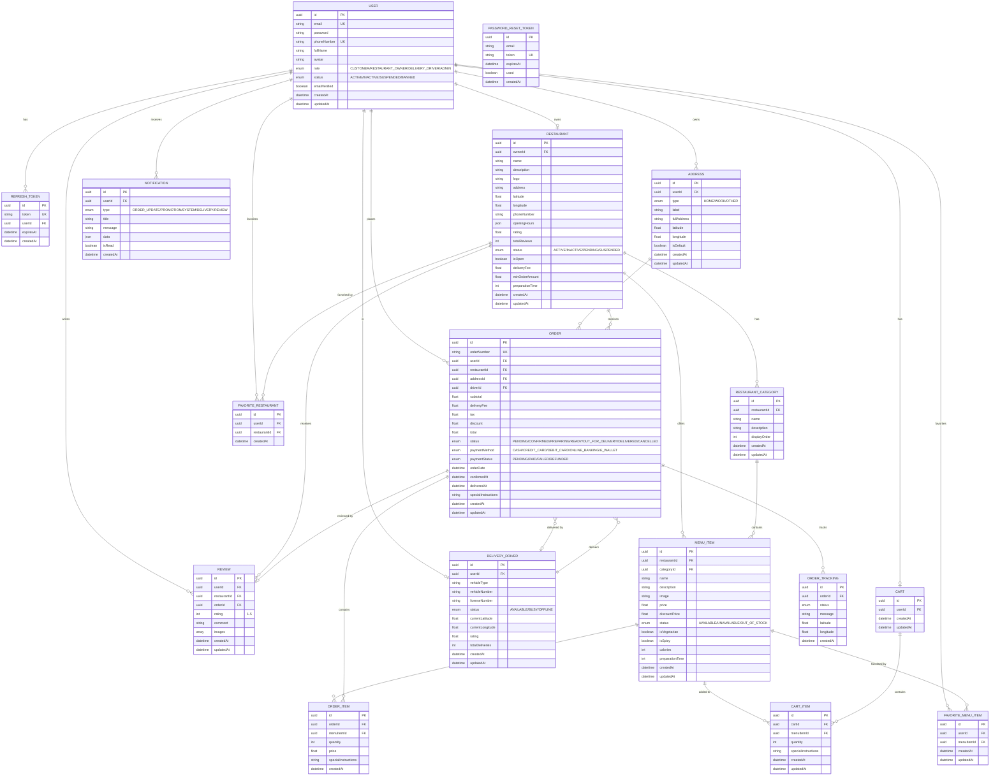

# 📊 FOOD DELIVERY APP - DATABASE SCHEMA

## Sơ đồ ERD (Entity Relationship Diagram)



---

## 📋 Tổng quan Tables

| # | Table | Records | Purpose |
|---|-------|---------|---------|
| 1 | users | Core | Tất cả user accounts (customer, owner, driver, admin) |
| 2 | refresh_tokens | Auth | JWT refresh tokens |
| 3 | password_reset_tokens | Auth | Password reset flow |
| 4 | addresses | Location | Delivery addresses |
| 5 | restaurants | Business | Restaurant profiles |
| 6 | restaurant_categories | Menu | Menu organization |
| 7 | menu_items | Product | Food items |
| 8 | carts | Shopping | Shopping cart (1 per user) |
| 9 | cart_items | Shopping | Items in cart |
| 10 | orders | Transaction | Customer orders |
| 11 | order_items | Transaction | Items in order |
| 12 | order_tracking | Tracking | Order status history |
| 13 | delivery_drivers | Delivery | Driver profiles |
| 14 | reviews | Feedback | Ratings & reviews |
| 15 | favorite_restaurants | Feature | Saved restaurants |
| 16 | favorite_menu_items | Feature | Saved menu items |
| 17 | notifications | Communication | Push notifications |

---

## 🔗 Key Relationships

### One-to-One (1:1)
- `User ←→ Restaurant` (owner)
- `User ←→ DeliveryDriver`
- `User ←→ Cart`
- `Order ←→ Review`

### One-to-Many (1:N)
- `User → Addresses`
- `User → Orders`
- `User → Reviews`
- `User → Notifications`
- `Restaurant → Categories → MenuItems`
- `Restaurant → Orders`
- `Order → OrderItems`
- `Order → OrderTracking`

### Many-to-Many (M:N)
- `User ←→ FavoriteRestaurant ←→ Restaurant`
- `User ←→ FavoriteMenuItem ←→ MenuItem`

---

## 🎯 Database Indexes

### Primary Keys (PK)
- Tất cả tables đều có `id` (UUID) làm primary key

### Unique Keys (UK)
- `users.email`
- `users.phoneNumber`
- `restaurants.ownerId`
- `orders.orderNumber`
- `refresh_tokens.token`
- `password_reset_tokens.token`
- `cart_items.[cartId, menuItemId]` (composite)
- `favorite_restaurants.[userId, restaurantId]` (composite)
- `favorite_menu_items.[userId, menuItemId]` (composite)

### Foreign Keys (FK)
- Tất cả relationships đều có foreign key constraints
- `onDelete: Cascade` cho most relations
- `onDelete: SetNull` cho optional relations

---

## 📊 Data Flow Examples

### User đặt hàng:
```
1. User browses → menuItems
2. User adds to cart → cart, cartItems
3. User checkout → order, orderItems created
4. Restaurant confirms → order.status = CONFIRMED
5. Driver accepts → order.driverId updated
6. Tracking updates → orderTracking records
7. Delivered → order.status = DELIVERED
8. User reviews → review created
```

### Restaurant Owner Journey:
```
1. Register → user (role = RESTAURANT_OWNER)
2. Create profile → restaurant
3. Add categories → restaurantCategories
4. Add items → menuItems
5. Receive orders → orders
6. Update status → orderTracking
```

### Delivery Driver Journey:
```
1. Register → user (role = DELIVERY_DRIVER)
2. Create profile → deliveryDriver
3. Set available → deliveryDriver.status = AVAILABLE
4. Accept order → order.driverId updated
5. Update location → orderTracking
6. Complete → order.status = DELIVERED
```

---

## 🎨 Cách xem diagram này:

### **Option 1: VS Code (Khuyên dùng)**
1. Cài extension: **Markdown Preview Mermaid Support**
2. Mở file này trong VS Code
3. Nhấn `Ctrl+Shift+V` để preview
4. Sẽ thấy diagram đầy màu sắc!

### **Option 2: Prisma Studio (Đang chạy)**
- Mở browser: http://localhost:5555
- Xem tất cả tables và data trực quan
- Click vào relations để navigate

### **Option 3: Online Mermaid Editor**
- Copy code mermaid ở trên
- Paste vào: https://mermaid.live
- Sẽ render diagram interactive

### **Option 4: Generate ERD từ Prisma**
```bash
# Install prisma-erd-generator
npm install -D prisma-erd-generator @mermaid-js/mermaid-cli

# Add to schema.prisma:
generator erd {
  provider = "prisma-erd-generator"
}

# Generate
npx prisma generate
```

---

## 🔍 Query Examples

### Lấy user với tất cả relations:
```typescript
const user = await prisma.user.findUnique({
  where: { id: userId },
  include: {
    addresses: true,
    orders: {
      include: {
        restaurant: true,
        items: {
          include: { menuItem: true }
        }
      }
    },
    cart: {
      include: {
        items: {
          include: { menuItem: true }
        }
      }
    },
    favoriteRestaurants: {
      include: { restaurant: true }
    },
    favoriteMenuItems: {
      include: { menuItem: true }
    }
  }
});
```

### Lấy restaurant với menu:
```typescript
const restaurant = await prisma.restaurant.findUnique({
  where: { id: restaurantId },
  include: {
    owner: true,
    categories: {
      include: {
        menuItems: {
          where: { status: 'AVAILABLE' }
        }
      }
    },
    reviews: {
      include: { user: true }
    }
  }
});
```

### Lấy order với tracking:
```typescript
const order = await prisma.order.findUnique({
  where: { id: orderId },
  include: {
    user: true,
    restaurant: true,
    address: true,
    driver: { include: { user: true } },
    items: { include: { menuItem: true } },
    tracking: { orderBy: { createdAt: 'desc' } },
    review: true
  }
});
```
